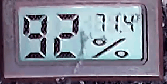
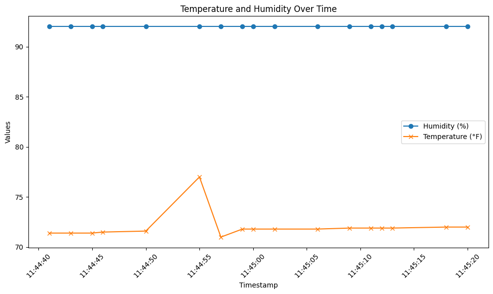
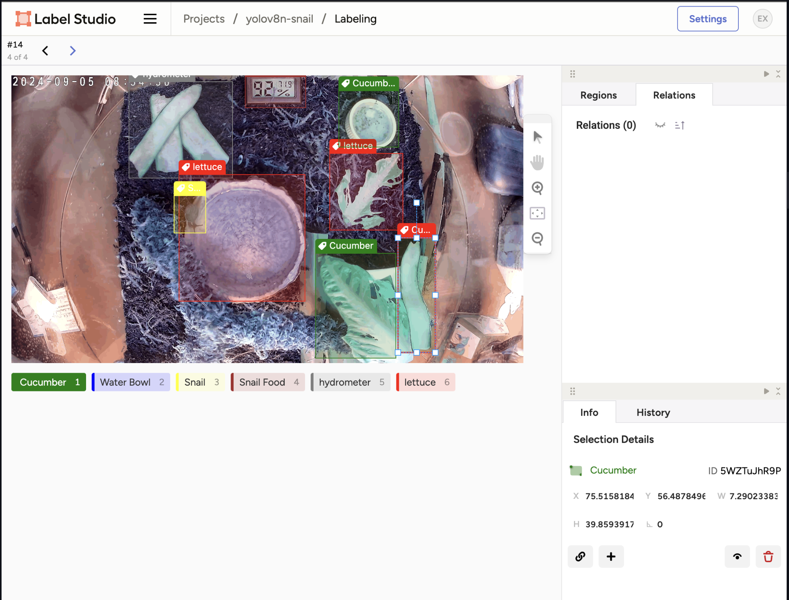

# Snail Tracker

This project is designed to observe and analyze the behavior of garden snails using computer vision and machine learning models. The Snail Tracker aims to gather environmental data and behavioral patterns of snails in their habitat to contribute to the understanding of their daily activities.


## Table of Contents
1. [Current Developments](#current-developments)
2. [Utilized Technology](#utilized-technology)
3. [Snail Care](#snail-care)
4. [Future Directions](#future-directions)
5. [Repository Structure](#repository-structure)
6. [Feature Extraction](#feature-extraction)
7. [Object Detection](#object-detection)
8. [Data Analysis and Visualization](#data-analysis-and-visualization)
9. [Training the YOLO Model](#training-the-yolo-model)
10. [Using the YOLO Model for Detection](#using-the-yolo-model-for-detection)

## Current Developments

### 1. Text Extraction from Digital Thermometer and Hygrometer
- **Computer Vision Models**: Utilizing Tesseract OCR and exploring more robust deep learning models like CRNN or Donut OCR to extract `temperature` and `humidity` readings from the [Mini Digital Temperature Humidity Meter](https://www.amazon.com/dp/B07GNMKYCZ).
- **Image Pre-processing**: Implementing techniques such as contrast enhancement, noise reduction, and thresholding to improve OCR accuracy.

### 2. AWS Integration for Model Training and Deployment
- **AWS Toolkit**: Connecting to AWS services like S3 and SageMaker through AWS Toolkit for Visual Studio Code.
- **Data Management**: Creating an S3 bucket (`snail-object-detection`) to manage data (e.g., videos, images, datasets) collected from the snail habitat.
- **Model Training and Deployment**: Using Amazon SageMaker for training computer vision models to extract environmental data (`temperature` and `humidity`) and perform object detection tasks.

### 3. Data Pipeline Development
- **Automatic Ingestion**: Setting up a data pipeline to ingest footage from the [Tapo TP-Link 2K QHD Security Camera](https://www.amazon.com/dp/B0CH45HPZT) into AWS S3 every 15 seconds.
- **Data Processing**: Developing scripts to process video footage, extract frames, and analyze snail behavior and environment.
- **Dataset Creation**: Building a dataset with columns like `temperature`, `humidity`, `is-eating`, `is-drinking`, `movement`, and `preferred food types`.

## Utilized Technology

- **Camera and Recording**: [Tapo TP-Link 2K QHD Security Camera](https://www.amazon.com/dp/B0CH45HPZT) captures high-resolution footage of the snail habitat.
- **Environmental Sensors**: [Mini Digital Temperature Humidity Meters](https://www.amazon.com/dp/B07GNMKYCZ) record real-time data, extracted using computer vision models.
- **Storage**: [Amazon Basics Micro SDXC Memory Card](https://www.amazon.com/dp/B08TJZDJ4D) stores video footage locally.

## Snail Care

- **Enclosure**: [REPTIZOO Small Glass Tank 8 Gallon](https://www.amazon.com/dp/B083PX9YR6) provides a controlled environment for snails.
- **Enrichment**: [12 Inch Pet Snail Climbing Toys](https://www.amazon.com/dp/B0CWNYQ43M) encourage natural behaviors.
- **Humidity Control**: [Ultra Fine Plastic Water Mist Sprayer](https://www.amazon.com/dp/B0948WBX9L) maintains the appropriate humidity.
- **Substrate**: [Natural Coconut Fiber Substrate](https://www.amazon.com/dp/B0BWRHB88C) supports burrowing and moisture retention.
- **Water Supply**: [Water Bowl](https://www.amazon.com/dp/B08GNZ4737) provides a safe drinking source.
- **Food**: [Pet Land Snail Food](https://www.amazon.com/dp/B0B8QC4B8X) supports shell growth and health.

## Future Directions

- **Data Collection Optimization**: Fine-tune the data collection intervals to balance richness and storage efficiency.
- **Advanced Behavioral Analysis**: Train models to recognize specific behaviors and develop algorithms to analyze preferences.
- **Improving Model Accuracy**: Experiment with different computer vision models and architectures (e.g., YOLO, SSD, EfficientDet).
- **Edge Deployment**: Investigate deploying models on edge devices to reduce latency and reliance on cloud infrastructure.

## Feature Extraction

### Extracting Frames from the Video

To analyze snail behavior, frames are extracted from the video to create a time series dataset. Frames are extracted at 1-minute intervals to minimize redundancy.

```python

import cv2
import imageio

# Load the video
video_path = 'IMG_3741.mp4'
cap = cv2.VideoCapture(video_path)

# Get total frames and frame rate
total_frames = int(cap.get(cv2.CAP_PROP_FRAME_COUNT))
fps = int(cap.get(cv2.CAP_PROP_FPS))

# Calculate video duration
video_duration = total_frames / fps
print(f"Video duration: {video_duration:.2f} seconds")

# Extract frames at 1-minute intervals
interval_seconds = 60
frame_interval = int(interval_seconds * fps)

extracted_frames = []

for frame_number in range(0, total_frames, frame_interval):
    cap.set(cv2.CAP_PROP_POS_FRAMES, frame_number)
    ret, frame = cap.read()
    if not ret:
        break
    extracted_frames.append(frame)
    print(f"Extracted frame at minute: {frame_number // frame_interval}")

cap.release()

# Save frames as GIF
gif_path = 'snail_tracking_full_fast.gif'
imageio.mimsave(gif_path, extracted_frames, duration=1, loop=0)

```

## Data Analysis and Visualization

### Using OpenAI API to Extract Data from Frames

The extracted frames are analyzed using OpenAI's API to identify temperature and humidity values, which are then visualized over time.



### Plotting the Extracted Data

A line plot shows changes in temperature and humidity over time, enabling correlation analysis with snail behavior.



```python

import pandas as pd
import matplotlib.pyplot as plt

df = pd.read_csv('snail_data.csv')
df['Timestamp'] = pd.to_datetime(df['Timestamp'])

plt.figure(figsize=(10, 6))
plt.plot(df['Timestamp'], df['Humidity (%)'], label='Humidity (%)', marker='o')
plt.plot(df['Timestamp'], df['Temperature (°F)'], label='Temperature (°F)', marker='x')
plt.title('Temperature and Humidity Over Time')
plt.xlabel('Timestamp')
plt.ylabel('Values')
plt.legend()
plt.xticks(rotation=45)
plt.tight_layout()
plt.show()


```

## Training the YOLO Model

### Setting Up the Training for YOLO Model Using Label Studio Annotations

Data labeling is performed using Label Studio, and the dataset is organized for YOLO training. A data.yaml file is created to specify dataset paths and classes.



```python

# data.yaml
train: /path/to/train/images
val: /path/to/val/images

nc: 7  # Number of classes
names: ['Cucumber', 'Snail', 'Snail Food', 'Water Bowl', 'Hydrometer', 'Lettuce', 'Tunnel']


```

## Training Script

A training script (`train.py`) is created to train the YOLO model, adjust parameters, and save checkpoints.

```python

from ultralytics import YOLO

# Step 1: Define the path to your data configuration file and model
data_path = 'data.yaml'  # Path to your data.yaml file
model_path = 'yolov8n.pt'  # YOLOv8 nano model (you can change this to yolov8s.pt, yolov8m.pt, etc.)

# Step 2: Create a YOLO model object
model = YOLO(model_path)

# Step 3: Train the model
model.train(
    data=data_path,  # Path to data configuration file
    epochs=100,  # Number of epochs to train for
    batch=16,  # Batch size for training
    imgsz=640,  # Image size (640x640 is the default for YOLOv8)
    name='snail-detection',  # Name of the training run
    save_period=1,  # Save checkpoint every epoch
    device='cpu'  # Use CPU since no CUDA device is available
)

# Step 4: Evaluate the model
metrics = model.val()

# Step 5: Export the trained model for inference (optional)
model.export(format='onnx')  # Export the trained model to ONNX format (you can also export to 'torchscript', 'coreml', etc.)

# Step 6: Print results
print(f"Training completed. Checkpoints are saved in the 'runs' directory.")
print(f"Validation metrics: {metrics}")

```

## Using the YOLO Model for Detection

The trained YOLO model can be used for real-time object detection in new video footage. The results are annotated and analyzed for behavior monitoring and analysis.

```python

# Load trained YOLO model
model = YOLO('best.pt')

# Predict objects in a new video
results = model.predict('new_video.mp4')
results.show()


```